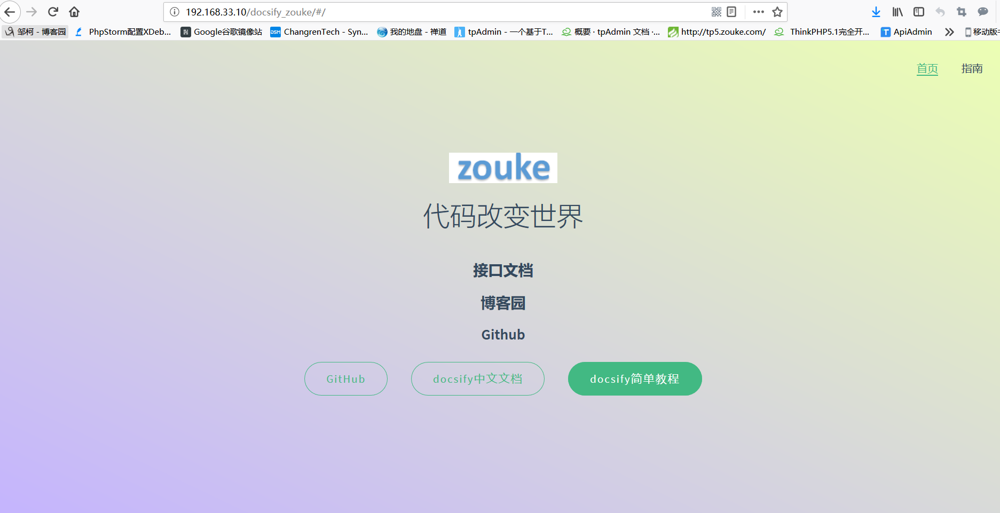
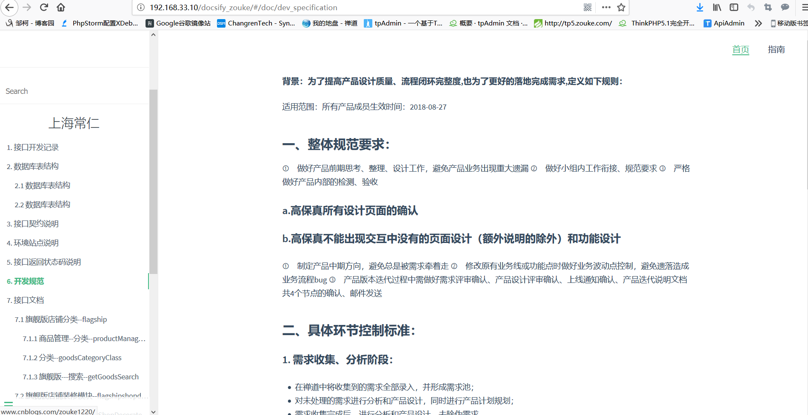

# 此套接口文档后期将由代码自动生成,目前已实现,后期还需要优化处理,现在还需要手动写markdown文件
# 目前这个文档的框架已搭建出来了,后期db/doc栏目将由代码生成

# XX科技 | API接口文档

> C:\software\phpStudy\PHPTutorial\WWW\feelee\docsify_test>docsify serve

> 接口文档目录结构
<pre><code>
├─docsify_test                                根目录
   ├─_coverpage.md                            定制文档封面
   ├─_navbar.md                               定制文档导航栏
   ├─_sidebar.md                              定制文档侧边栏
   ├─README.md                                指南(会做为主页内容渲染)
   ├─.nojekyll                                用于阻止 GitHub Pages 会忽略掉下划线开头的文件
   ├─index.html                               入口文件
   ├─404.html                                 找不到时渲染加载文件 
   ├─logo                                     网站logo存放目录 
   │   └─logo.gif.png                         网站logo图片
   └─doc                                      接口文档存放目录
       ├─api_log.md                           接口文档(Api开发日志记录文件)
       ├─dev_specification.md                 接口文档(项目开发规范文件)
	   ├─env_site.md                          接口文档(项目环境站点文件)
	   ├─interface_contract.md                接口文档(接口契约文件)
	   ├─interface_returns_status_code.md     接口文档(接口返回状态码说明文件)
	   ├─db                                   数据库表结构存放目录 
	   │  ├─changren.md                       数据库名为changren的表结构文件
	   │  └─tpadmin.md                        数据库名为tpadmin的表结构文件
	   │	  
           └─doc                                  Api接口文档存放目录
	      ├─api                               项目1名api
	      │   ├─category.md                   控制器名category
	      │   ├─flagship.md                   控制器名flagship
	      │   └─flagshipshopdecorate.md       控制器名flagshipshopdecorate
	      │  
	      ├─fli                               项目2名fli
	      │   ├─category.md
	      │   ├─flagship.md
	      │   ├─flagshipshopdecorate.md
	      │   └─goodsmanage.md
	      │ 
	      └─tp5                               项目3名tp5
	          ├─flagship.md
	          └─flagshipshopdecorate.md
</code></pre>

